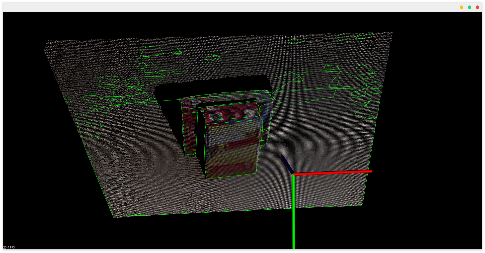
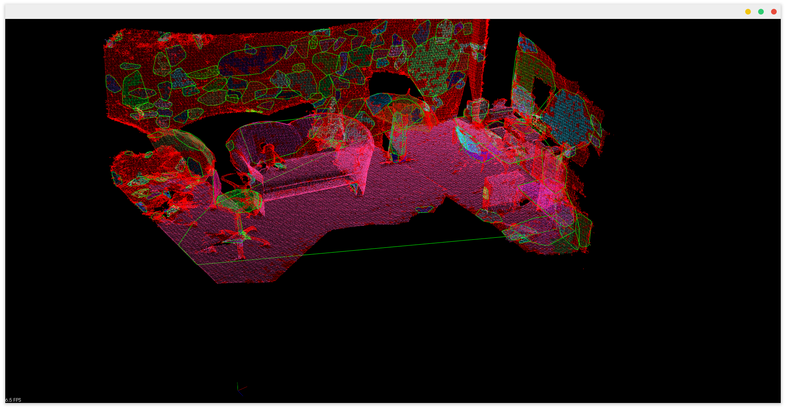

# Simple Plane Fitting

Simple plane fitting with PCL/C++:
- Region Growing(normal based clustering)
- RANSAC Plane Fitting
- Convex Hull to get the outline




### Build

requirement: `apt install libpcl-dev`

```
mkdir build
cd build
cmake ..
make
```

### Run

```
# Usage: ./simple_plane_fitting [data_path] [visualize] [downsample size] [colorless]
./simple_plane_fitting ../data/table.pcd true
./simple_plane_fitting ../data/kinfu.pcd true 0.01 true
```
